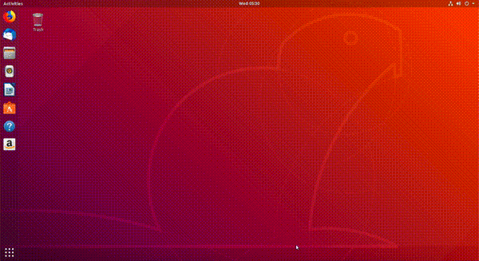
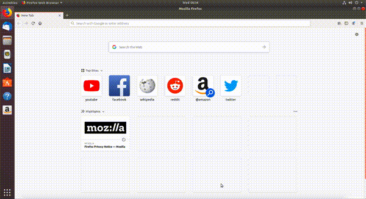
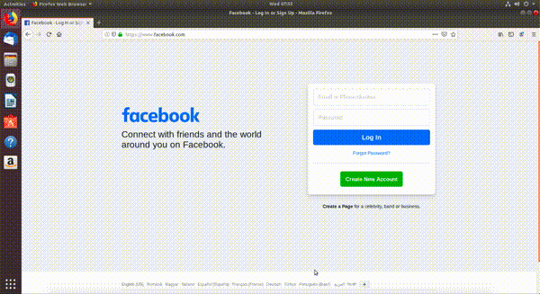
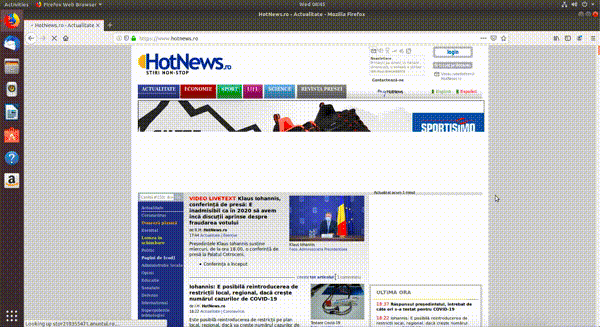
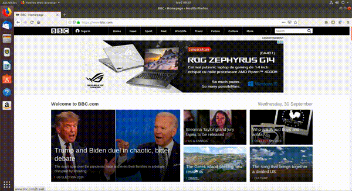
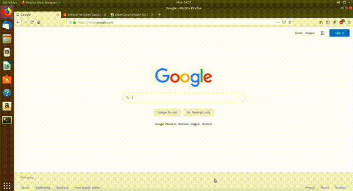
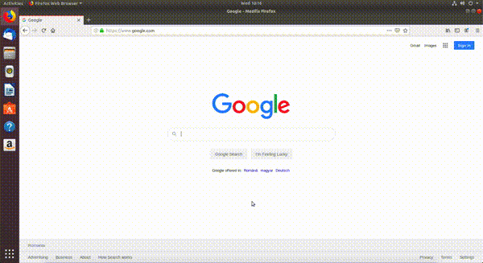
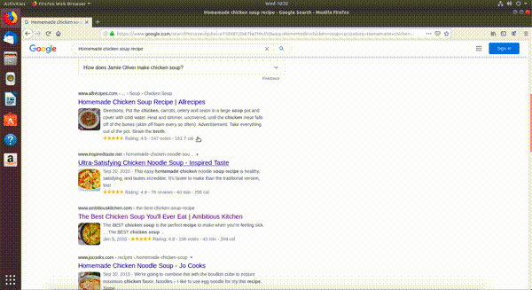

# Folosirea eficientă a browserului web

În viața de zi cu zi, aplicația pe care o folosim probabil cel mai des, indiferent de platformă sau sistem de operare, este **browserul web**.
Acesta rulează pe smartphone-uri, laptopuri, tablete și este folosit pentru rularea aplicațiilor web cum ar fi clienți de mesagerie, rularea de jocuri, afișarea de conținut al unei pagini cu știri, sau conținut pe rețele de socializare.

**Browserul web** este o aplicație pe care o folosim în mod constant; de aceea ne dorim să o folosim într-un mod cât mai eficient.
Adică să petrecem cât mai puțin timp manevrând aplicația și cat mai mult timp folosind aplicația la capacitate maximă.

Vom folosi [Firefox](https://www.mozilla.org/en-US/firefox/new/) în această carte, însă conceptele prezentate sunt similare și în alte browsere ([Google Chrome](https://www.google.com/chrome/), [Chromium](https://www.chromium.org), [Safari](https://www.apple.com/safari/), [Opera](https://www.opera.com), [Edge](https://www.microsoft.com/en-us/edge), etc).
Firefox este browserul default instalat în Ubuntu 18.04.

## Pornirea și oprirea browserului

Browserul web este un exemplu de *aplicație software*.
Am vorbit despre pornirea și oprirea aplicațiilor în secțiunea `basic_start_stop_apps`.

Atunci când browserul este pornit, spunem că acesta *rulează*.

### Pornirea browserului web

Putem porni browserul Firefox în mai multe moduri (așa cum am menționat în secțiunea `basic_start_stop_apps`):

- Folosind iconuri.

- Folosind un prompt de tip *application launcher* lansat prin combinația de taste `Alt+F2`.

- Deschizând un terminal și tastând în el comanda de pornire (în cazul browserului Firefox este `firefox`), ca în imaginea de mai jos:

  <figure>
  
  </figure>

### Oprirea browserului web

Putem opri browserul Firefox în mai multe moduri, așa cum am menționat în secțiunea `basic_stop_gui_app_icons`:

- Folosind butonul de închidere al ferestrei grafice, în forma unui simbol `x`.
- Folosind combinația de taste `Alt+F4`, care închide fereastra grafică, o scurtătură pentru folosirea butonului de închidere.

După folosirea uneia dintre metodele de mai sus, aplicația Firefox este oprită.
Adică nu mai putem interacționa cu ea, nu mai folosește resursele sistemului.
Pentru a accesa din nou aplicații web, va trebui să repornim aplicația Firefox, folosind una dintre motodele din secțiunea `basic_start_browser`.

## Acțiuni în browserul web

În această subsecțiune vom prezenta cele mai folosite componente ale interfeței grafice a browserului web și cum să le folosim eficient.
În general, avem cel puțin două variante pentru a face o acțiune:

1.  Folosind butoane din interfața grafică
2.  Folosind combinația de taste echivalentă clickurilor

Vom face o paralelă între cele două în această subsecțiune.

Folosirea combinațiilor de taste este mai rapidă, mai eficientă, dar necesită un efort de memorare din partea utilizatorului.
Utilizatorii avansați vor folosi preponderent combinații de taste.

### Folosirea barei de adresă

Dacă dorim să accesăm pagina web (*URL-ul*, *site-ul*, *linkul*) **google.com**, trebuie să introducem șirul `google.com` în bara de adrese.
Putem plasa cursorul în bara de adrese în două moduri:

- Folosind clickuri ca în imaginea de mai jos:

  <figure>
  
  </figure>

- Folosind combinația de taste `Ctrl+l`.

Odată accesată bara de adrese putem introduce șirul `google.com`.

**Exerciții**

1.  Accesați paginile **curs.upb.ro**, **studenti.pub.ro**, **hotnews.ro**, **facebook.com** folosind ambele metode prezentate mai sus.

### Navigarea folosind butoane

Uneori avem nevoie să revenim la pagini accesate anterior.
După ce am navigat pe o rețea de socializare, am deschis un articol apărut în feed, l-am citit și acum vrem să revenim la feedul de pe rețeaua de socializare.
Navigăm la pagina anterioară pentru a reveni pe rețea.

Putem naviga la pagini navigate anterior în două moduri:

- Folosind butoanele **săgeată stânga** (*Go back one page*) și **săgeată dreapta** (*Go forward one page*) din interfața grafică a browserului, ca în imaginea de mai jos:

  <figure>
  
  </figure>

  Am trecut prin paginile **facebook.com**, **hotnews.ro**, **studenti.pub.ro** și înapoi la **hotnews.ro**, **facebook.com**.

- Folosind combinațiile de taste echivalente cu clickurile pe săgețile stânga/dreapta din browser:

  - Navigare înapoi: `Alt+săgeată stânga`.
  - Navigare înainte: `Alt+săgeată dreapta`.

**Exerciții**

1.  Folosind combinația de taste `Ctlr+l`, accesați bara de adrese a browserului și deschideți pagina **youtube.com**.
2.  Navigați **înapoi** folosind butonul *Go back one page* până ajungeți la pagina **hotnews.com**.
3.  Navigați **înainte** folosind butonul *Go forward one page* până ajungeți la pagina **facebook.com**.
4.  Navigați **înapoi** folosind combinația de taste `Alt+săgeată stânga` până ajungeți la pagina **google.com**.

### Scroll în browser

Principalul motiv pentru care folosim browsere web este ca să vizualizăm conținut de pagini.
Navigarea sus/jos în cadrul unei pagini web se numește **scroll**.

Accesăm pagina **hotnews.ro**.
Putem da scroll în pagină în mai multe moduri:

- Folosind mouse-ul prin rotiță / touchpadul.
- Folosind butoanele `PageDown` și `PageUp` de pe tastatură.
  Așa ne deplasăm câte un "ecran" în jos sau în sus.
- Folosind butoanele `Space` și `Shift+Space` de pe tastatură.
  Așa ne deplasăm câte un "ecran" în jos sau în sus.

În imaginea de mai jos se vede cum dăm scroll sus și jos pe pagina **hotnews.ro**:

<figure>

</figure>

### Reîmprospătarea paginii

Avem situații în care trebuie să reîmprospătăm (*refresh*) conținutul unei pagini web.
Spre exemplu, am deschis o pagină și imaginile nu au fost încărcate corect (am avut probleme cu conexiunea la Internet în acel moment).
Alt caz ar putea fi atunci când așteptăm ca pe o pagină să fie publicate notele noastre la un examen, așa că vrem să reîmprospătăm pagina web să vedem dacă aceasta a fost actualizată.

Intrăm pe pagina **bbc.com**.

Putem reîmprospăta pagina web în mai multe moduri:

- Folosind butonul de remîprospătare (*refresh*) din browser ca în imaginea de mai jos:

  <figure>
  
  </figure>

- Folosind tasta `F5`.

### Lucrul cu taburi

Un caz pe care îl întâlnim des atunci când lucrăm cu un browser web, este să avem mai multe pagini web deschise simultan.
Spre exemplu, avem nevoie să căutăm o informație pe Google, cum ar fi *Cum gătim supă de pui acasă*.
Există multe rețete pe Internet, vrem să citim mai multe până să ne hotărăm pe care să o folosim.

Cel mai eficient mod pentru a face acest lucru este să folosim **taburi în browser**.
Aplicația Firefox aflată în rulare poate avea unul sau mai multe taburi pornite.

În subsecțiunile următoare vom vorbi despre cum să deschidem taburi, să navigăm între taburi și să închidem taburi eficient.

#### Deschiderea taburilor

Atunci când deschidem aplicația Firefox, aceasta va avea un singur tab deschis: cel cu pagina principală.
Accesăm pagina **google.com**.

Putem deschide un alt tab în browser în două moduri:

- Folosind butonul cu simbolul `+` din interfața grafică a browserului:

  <figure>
  
  </figure>

- Folosind combinația de taste `Ctrl+t`.

**Exerciții**

1.  Deschideți două taburi noi folosind simbolul `+`.
2.  În primul tab deschis navigați pe pagina **ubuntu.com**, iar în al doilea pe pagina **ocw.cs.pub.ro**. Folosiți combinația de taste `Ctrl+l` și apoi scrieți adresa paginilor.

#### Navigarea între taburi

Avem acum trei taburi deschise:

1.  Primul pe pagina **google.com**.
2.  Al doilea pe pagina **ubuntu.com**.
3.  Al treilea pe pagina **ocw.cs.pub.ro**.

Putem naviga printre cele 3 (la modul general *N*) taburi în mai multe moduri:

- Folosind clickuri. Dăm click pe fiecare tab în parte, ca în imaginea de mai jos:

  <figure>
  
  </figure>

- Folosind combinația de taste `Alt+<număr>`.
  Spre exemplu, combinația de taste `Alt+2` ne va duce pe al doilea tab, adică pe pagina **ubuntu.com**.

**Exerciții**

1.  Deschideți încă două taburi pe lângă cele trei deja deschise.
2.  Accesați al patrulea tab folosind combinația de taste `Alt+4`.
3.  Accesați primul tab folosind combinația de taste `Alt+1`.
4.  Apăsați combinația de taste `Alt+9`. Ce observați?

#### Închiderea taburilor

Fiecare tab deschis consumă resurse ale sistemului, așadar este bine să închidem aplicațiile (sau taburi ale lor) atunci când nu le mai folosim.

Putem închide un tab în browser în mai multe moduri:

- Folosind butonul cu simbolul `x` din browser ca în imaginea de mai jos:

  <figure>
  
  </figure>

- Folosind combinația de taste `Ctrl+w`.

**Exerciții**

1.  Închideți al cincilea tab folosind combinația de taste `Ctrl+w`.
2.  Închideți al doilea și al treilea tab folosind combinația de taste `Ctrl+w`. Navigați între taburi folosind combinația de taste `Alt+<număr>`.
3.  Închideți ultimele 2 taburi folosind combinația de taste `Ctrl+w`.

> [!NOTE]
> La închiderea ultimului tab din browser se închide aplicația Firefox.

#### Deschiderea unui link în alt tab

Să presupunem că vrem să găsim rețeta perfectă pentru supă de pui gătită în casă și vrem să deschidem mai multe rețete, fiecare într-un tab, pentru a le compara și pentru a alege rețeta cea mai bună.
Vom vedea cum să deschidem linkurile de rețete găsite pe Google într-un alt tab.
Alternativa la a deschide linkurile într-un alt tab ar fi să le deschidem într-o altă fereastră.
Lucrul cu ferestrele aplicației (în cazul nostru *Firefox*) poate deveni greu de gestionat.

Deschidem din nou browserul Firefox.
Intrăm pe [Google](www.google.com) și căutăm *Homemade chicken soup recipe* ca în imaginea de mai jos:

<figure>

</figure>

Putem deschide rețete găsite în alte taburi în mai multe moduri:

- Folosind clickuri. Folosim *click dreapta* pe link după care alegem opțiunea *Open Link in New Tab* din meniul contextual ca în imaginea de mai jos:

  <figure>
  
  </figure>

- Apăsând tasta `Ctrl` și click pe link.

- Apăsând rotița mouse-ului când cursorul este deasupra linkului.

**Exerciții**

1.  Deschideți un tab nou și accesați pagina **google.com**.
2.  Căutați pe Google întrebarea *Which browser should I use Linux*.
3.  Deschideți primele 2 linkuri găsite în taburi diferite folosind clickuri.
4.  Deschideți următoarele 2 linkuri găsite în taburi diferite folosind tasta `Ctrl` urmată de click pe link.
5.  Navigați printre paginile deschise folosind combinația de taste `Alt+<număr>`.
6.  Închideți browserul folosind combinația de taste `Ctrl+F4`.
