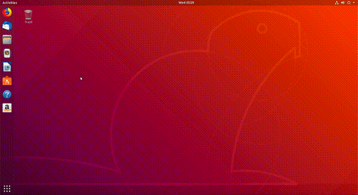
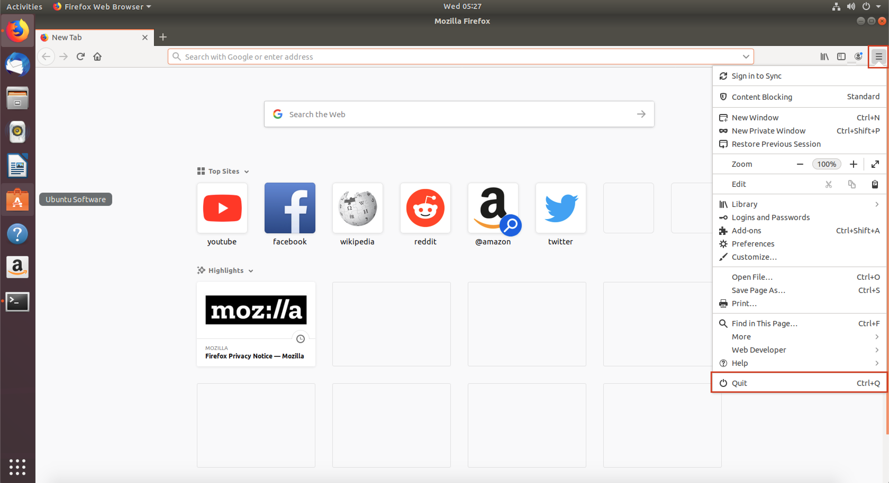
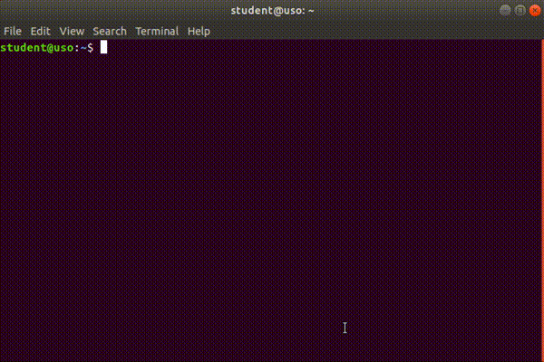
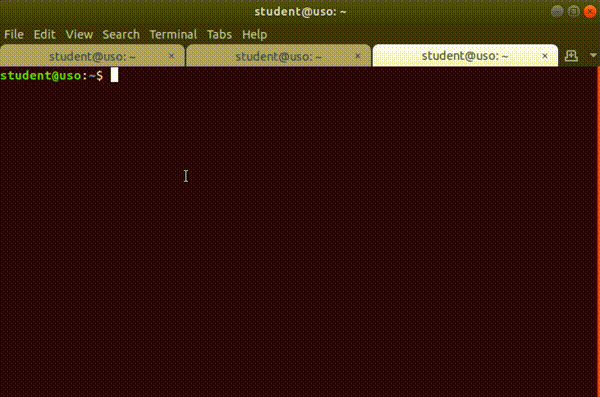

# Sumar - Cheatsheet

## Scurtături pentru folosirea browserului web

### Pornirea browserului web

- Folosind iconuri, ca în imaginea de mai jos:

  <figure>
  
  </figure>

- Folosind combinația de taste (*scurtătura*, *shortcutul*) `Alt+F2` și introducând șirul `firefox`, ca în imaginea de mai jos:

  <figure>
  
  </figure>

- Folosind linia de comandă, ca în imaginea de mai jos:

  <figure>
  
  </figure>

### Oprirea browserului web

- Folosind butonul de închidere a ferestrei grafice, în forma unui simbol `x`.

- Folosind intrarea de tip *Quit* din meniul grafic al aplicației, ca în imaginea de mai jos, specifică aplicației Firefox:

  <figure>
  
  </figure>

- Folosind combinația de taste `Alt+F4` care închide fereastra grafică, o scurtătură pentru folosirea butonului de închidere.

- Folosind combinația de taste `Ctrl+q`, specifică aplicației Firefox.

- Închizând ultimul tab prin folosirea combinației de taste `Ctrl+w`.

### Folosirea barei de adresă

- Folosind clickuri, ca în imaginea de mai jos:

  <figure>
  
  </figure>

- Folosind combinația de taste `Ctrl+l`.

### Navigarea folosind butoane

- Folosind butoanele **săgeată stânga** (*Go back one page*) și **săgeată dreapta** (*Go forward one page*) din interfața grafică a browserului, ca în imaginea de mai jos:

  <figure>
  
  </figure>

- Folosind combinațiile de taste echivalente cu clickurile pe săgețile stânga/dreapta din browser:

  - Navigare înapoi: `Alt+săgeată stânga` sau `Ctrl+[`.
  - Navigare înainte: `Alt+săgeată dreapta` sau `Ctrl+]`.

### Scroll în browser

- Folosind mouse-ul prin rotiță.
- Folosind touchpadul.
- Folosind tastele *săgeată sus*/\*săgeată\* jos.
  Așa ne deplasăm în sus/jos câte o linie.
- Folosind butoanele `PageDown` și `PageUp` de pe tastatură.
  Așa ne deplasăm câte un "ecran" în jos sau în sus.
- Folosind butoanele `Space` și `Shift+Space` de pe tastatură.
  Așa ne deplasăm câte un "ecran" în jos sau în sus.

### Reîmprospătarea paginii

- Folosind butonul de reîmprospătare (*refresh*) din browser, ca în imaginea de mai jos:

  <figure>
  
  </figure>

- Folosind tasta `F5`.

- Folosind combinația de taste `Ctrl+r`.

### Deschiderea taburilor

- Folosind butonul cu simbolul `+` din interfața grafică a browserului, ca în imaginea de mai jos:

  <figure>
  
  </figure>

- Folosind combinația de taste `Ctrl+t`.

### Navigarea printre taburi

- Folosind clickuri, ca în imaginea de mai jos:

  <figure>
  
  </figure>

- Folosind combinația de taste `Alt+<număr>`.

### Închiderea taburilor

- Folosind butonul cu simbolul `x` din browser, ca în imaginea de mai jos:

  <figure>
  
  </figure>

- Folosind combinația de taste `Ctrl+w`.

- Folosind combinația de taste `Ctrl+F4`.

### Deschiderea unui link în alt tab

- Folosind clickuri. Folosim *click dreapta* pe link după care alegem opțiunea *Open Link in New Tab* din meniul contextual, ca în imaginea de mai jos:

  <figure>
  
  </figure>

- Apăsând tasta `Ctrl` și click pe link.

- Apăsând rotița mouse-ului când cursorul este deasupra linkului.

## Scurtături pentru folosirea terminalului

### Deschiderea terminalului

- Folosind iconuri, ca în imaginea de mai jos:

  <figure>
  
  </figure>

- Folosind combinația de taste `Alt+F2`, ca în imaginea de mai jos:

  <figure>
  
  </figure>

- Apăsând *click dreapta* și apoi butonul *Open Terminal*, ca în imaginea de mai jos:

  <figure>
  
  </figure>

- Folosind combinația de taste `Ctrl+Alt+t`.

### Închiderea terminalului

- Folosind butonul `x` din partea dreaptă-sus a aplicației, ca în imaginea de mai jos:

  <figure>
  
  </figure>

- Folosind combinația de taste `Ctrl+Shift+q`.

- Folosind combinația de taste `Alt+F4`.

- Folosind combinația de taste `Ctrl+d`.

### Deschiderea taburilor

- Folosind meniul aplicației, ca în imaginea de mai jos:

  <figure>
  
  </figure>

  Apăsăm pe opțiunea *File* din meniu, după care pe butonul *New Tab*.

- Apăsând *click dreapta* în interiorul terminalului, după care pe butonul *New Tab*, ca în imaginea de mai jos:

  <figure>
  
  </figure>

- Folosind combinația de taste `Ctrl+Shift+t`.

### Închiderea taburilor

- Folosind meniul aplicației, ca în imaginea de mai jos:

  <figure>
  
  </figure>

- Folosind butonul (*simbolul*) `x` din dreptul tabului, ca în imaginea de mai jos:

  <figure>
  
  </figure>

- Folosind combinația de taste `Ctrl+Shift+w`.

### Navigarea printre taburi

- Folosind clickuri, ca în imaginea de mai jos:

  <figure>
  
  </figure>

- Folosind combinația de taste `Alt+<număr>`, unde *număr* este numărul (*indexul*) tabului la care vrem să ajungem.
  Primul tab are numărul 1, al nouălea tab are numărul 9, iar al zecelea are numărul 0.

- Folosind combinațiile de taste `Ctrl+PageUp`, pentru a trece la următorul tab și `Ctrl+PageDown`, pentru a trece la tabul anterior.

### Scroll în terminal

- Folosind mouse-ul sau touchpad-ul.
- Folosind combinațiile de taste `Shift+PageUp` și `Shift+PageDown`.

### Golirea ecranului de terminal

- Folosind comanda `clear` în terminal, ca în imaginea de mai jos:

  <figure>
  
  </figure>

- Folosind combinația de taste `Ctrl+l` în terminal.

### Copierea textului

- Selectăm textul, apăsăm *click dreapta* și apăsăm butonul *Copy*, ca în imaginea de mai jos:

  <figure>
  
  </figure>

- Selectăm textul și apăsăm combinația de taste `Ctrl+Insert`.

- Selectăm textul și apăsăm combinația de taste `Ctrl+Shift+c`.

### Lipirea textului

- Apăsăm *click dreapta* și apăsăm butonul *Paste*, ca în imaginea de mai jos:

  <figure>
  
  </figure>

- Apăsăm combinația de taste `Shift+Insert`.

- Apăsăm combinația de taste `Ctrl+Shift+v`.
