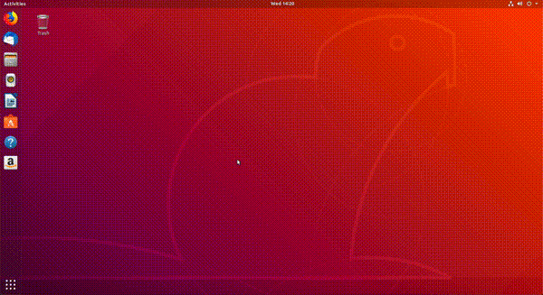
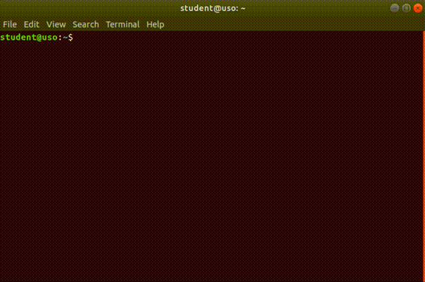
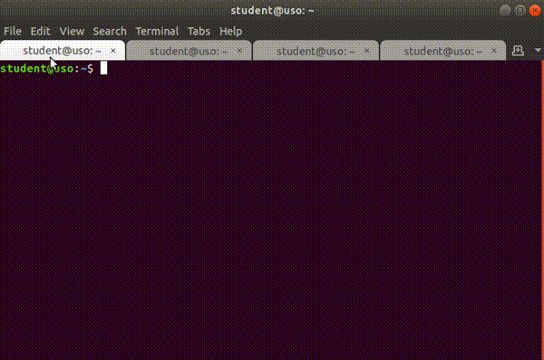
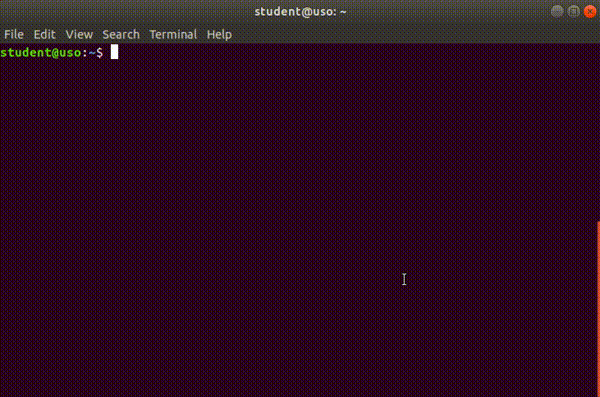
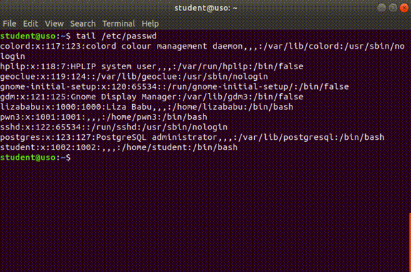

# Lucrul în terminal

**GNOME Terminal** (uzual numit *terminalul*) este o aplicație software, la fel ca *LibreOffice* și *Firefox*.
Terminalul este folosit, în general, pentru rularea **aplicațiilor software** (*programe*, *utilitare*) care nu au **interfață grafică** (*GUI*).
Exemple de astfel de aplicații / programe / utilitare sunt: **ls**, **tree**, **ps** și **echo**.
Toate acestea (și altele) vor fi prezentate ulterior în această carte.
Pentru moment este suficient să știm că ele există.

Folosim linia de comandă prin intermediul aplicației *GNOME Terminal*, care are identificatorul **gnome-terminal**.
Avem nevoie de linia de comandă ca să rezolvăm mai rapid unele taskuri.
Vom aprofunda aceste lucruri în capitolul `Îmbunătățirea lucrului în linia de comandă`.

## Deschiderea și închiderea terminalului

Fiind o aplicație ca oricare alta, avem mai multe moduri prin care putem să **deschidem** aplicația *GNOME Terminal* (la fel cum am menționat în secțiunea `basic_start_stop_apps`):

- Apăsând *click dreapta* și apoi butonul *Open Terminal*, ca în imaginea de mai jos:

  <figure>
  
  </figure>

- Folosind combinația de taste `Ctrl+Alt+t`.

Pentru **închiderea** terminalului avem următoarele variante:

- Folosind butonul `x` din partea dreaptă-sus a aplicației.
- Folosind combinația de taste `Ctrl+d`.

**Exerciții**

1.  Deschideți de patru ori aplicația *GNOME Terminal* folosind combinația de taste `Ctrl+Alt+t`.
2.  Închideți toate aplicațiile *GNOME Terminal* deschise folosind combinația de taste `Ctrl+d`.

## Folosirea taburilor în terminal

Avem următoarea situație: deschidem o aplicație din terminal și vrem să monitorizăm câte resurse folosește, totul din linia de comandă.
Ca să facem acest lucru, putem să deschidem două terminale: unul cu aplicația pe care vrem să o monitorizăm și unul în care pornim aplicația de monitorizare.
Pe lângă aceste două acțiuni, putem să avem nevoie să facem și altele, iar lucrul cu mai multe terminale deschise devine dificil.

La fel ca atunci când folosim un browser web, avem nevoie de taburi și în terminal.

În următoarele sub-subsecțiuni vom vorbi despre cum să deschidem, să închidem și să navigăm între taburile din terminal.

### Deschiderea și închiderea taburilor

Deschideți din nou aplicația *GNOME Terminal*.

Deschidem un nou tab atunci când avem nevoie să facem o altă operație, fără a o întrerupe pe cea de acum.
Închidem taburile în momentul în care am terminat o operație pentru a nu încărca sistemul.

Putem **deschide** un nou tab în terminal în mai multe moduri:

- Apăsând *click dreapta* în interiorul terminalului, după care pe butonul *New Tab*, ca în imaginea de mai jos:

  <figure>
  
  </figure>

- Folosind combinația de taste `Ctrl+Shift+t`.

Putem **închide** un tab în terminal în mai multe moduri:

- Folosind butonul (*simbolul*) `x` din dreptul tabului, ca în imaginea de mai jos:

  <figure>
  
  </figure>

- Folosind combinația de taste `Ctrl+d`.

**Exerciții**

1.  Deschideți un nou terminal folosind combinația de taste `Ctrl+Alt+t`.
2.  Deschideți două taburi de terminal noi folosind combinația de taste `Ctrl+Shift+t`,
3.  Închideți taburile folosind combinația de taste `Ctrl+d`.

### Navigarea între taburi

Vrem să navigăm între taburile din terminal, la fel ca în cazul browserului web, pentru a putea trece de la o operație începută la alta rapid.

Avem mai multe variante să facem acest lucru:

- Folosind clickuri, ca în imaginea de mai jos:

  <figure>
  
  </figure>

- Folosind combinația de taste `Alt+<număr>`, unde *număr* este numărul (*indexul*) tabului la care vrem să ajungem.
  Primul tab are numărul 1, al nouălea tab are numărul 9, iar al zecelea are numărul 0.
  Combinațiile de taste folosite în terminal sunt similare cu cele din browser, prezentate în secțiunea `basic_navigate_tabs_browser`.

**Exerciții**

1.  Deschdideți un nou terminal folosind combinația de taste `Ctrl+Alt+t`.
2.  Deschideți patru taburi folosind combinația de taste `Ctrl+Shift+t`.
3.  Mergeți pe primul tab folosind combinația de taste `Alt+1`.
4.  Mergeți pe al treilea tab folosind combinația de taste `Alt+3`.
5.  Mergeți pe al doilea tab folosind combinația de taste `Alt+2`.
6.  Mergeți pe primul tab folosind combinația de taste `Alt+1`.
7.  Închideți aplicația *GNOME Terminal* în orice mod vreți.

## Alte scurtături utile în terminal

Pe lângă scurtăturile de pornire/oprire a terminalului, de lucru cu taburi în terminal, mai există și alte scurtături cu care putem lucra în terminal mai rapid.

În subsecțiunile următoare vom vorbi despre scrollul, copierea și lipirea textului în terminal și despre golirea ecranului de terminal.

### Scroll

Pentru a da scroll în terminal avem mai multe moduri:

- Folosind mouse-ul sau touchpad-ul.
- Folosind combinațiile de taste `Shift+PageUp` și `Shift+PageDown`.

### Golirea ecranului de terminal

Pentru golirea ecranului de termninal avem mai multe variante:

- Folosind comanda `clear` în terminal, ca în imaginea de mai jos:

  <figure>
  
  </figure>

- Folosind combinația de taste `Ctrl+l` în terminal.

### Copierea și lipirea textului

Copierea și lipirea de text sunt operații *foarte* importante.
Vrem să evităm greșile de tastare pe cât posibil.
Folosirea acestor feature-uri este un mod de a preveni greșeli de tastare.

#### Copierea textului

În cadrul aplicației *GNOME Terminal* copierea textului se face diferit față de alte aplicații, în mai multe moduri:

- Selectăm textul, apăsăm *click dreapta* și apăsăm butonul *Copy*, ca în imaginea de mai jos:

  <figure>
  
  </figure>

- Selectăm textul și apăsăm combinația de taste `Ctrl+Insert`.

- Selectăm textul și apăsăm combinația de taste `Ctrl+Shift+c`.

> [!WARNING]
> Pentru copierea textului din terminal folosim combinația de taste `Ctrl+Shift+c` și **NU** `Ctrl+c`.
> În terminal, combinația de taste `Ctrl+c` are rolul de a opri o aplicație / un utilitar pornit.

#### Lipirea textului

În cadrul aplicației *GNOME Terminal* lipirea textului se face diferit față de alte aplicații, în mai multe moduri:

- Apăsăm *click dreapta* și apăsăm butonul *Paste*, ca în imaginea de mai jos:

  <figure>
  
  </figure>

- Apăsăm combinația de taste `Shift+Insert`.

- Apăsăm combinația de taste `Ctrl+Shift+v`.

> [!WARNING]
> Pentru lipirea textului în terminal folosim combinația de taste `Ctrl+Shift+v` și **NU** `Ctrl+v`.
