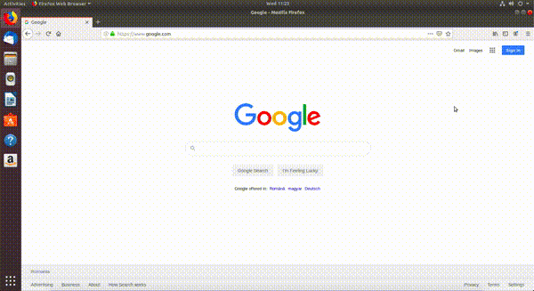
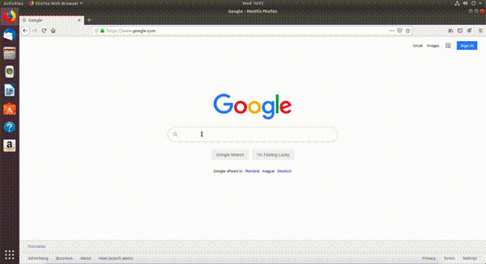
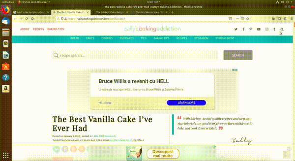
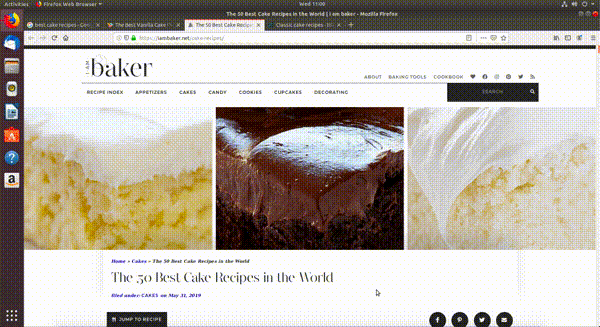
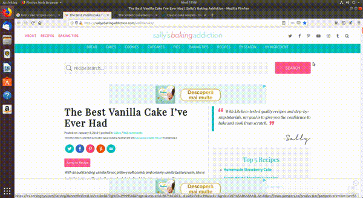

# Folosirea eficientă a browserului

Pentru instrucțiuni despre folosirea scurtăturilor în browser urmăriți secțiunea
`basic_use_browser`.

## Instalarea şi folosirea unui ad blocker

Atunci când navigăm pe Internet, găsim foarte multe informații utile, dar și foarte multe reclame.
Recomandăm instalarea unui **ad blocker**[^1] pentru a filtra reclamele care apar pe paginile web pe care le deschidem.
În această subsecțiune vom instala ad blockerul [AdBlock Plus](https://adblockplus.org) care vine sub forma unui **plug-in** (_o extensie_) pentru browerul web, care elimină (pe cât posibil) reclamele de pe paginile web pe care le deschidem.
Pentru a instala ad blockerul _AdBlock Plus_ urmăm pașii enumerați mai jos, prezenți și în GIF. Acești pași se aplică pentru browserul Mozilla Firefox.

<figure>

</figure>

### Pașii instalării unui ad blocker

1.  Apăsăm pe meniul browserului din dreapta sus
2.  Apăsăm pe butonul _Add-ons_
3.  Ne aflăm în secțiunea _Extensions_.
    În bara de căutare din partea de sus a ecranului scriem _adblock plus_ și apăsăm tasta `Enter`.
    Se deschide un nou tab.
4.  Apăsăm pe primul link apărut pe care scrie _AdBlock Plus_.
5.  Apăsăm pe butonul _Add to Firefox_.
6.  O fereastră de tip pop-up apare și apăsăm pe butonul _Add_.
7.  O altă fereastră de tip pop-up apare și apăsăm pe butonul _Okay, Got it_.

## Folosirea bookmarkurilor

Atunci când navigăm pe Internet putem să găsim, voluntar sau nu, pagini interesante pe care vrem să le revizităm cândva în viitor.
Ca să nu pierdem aceste pagini, folosim **bookmarkuri**.
În această sub-subsecțiune vom adăuga bookmarkuri noi pentru rețetele cele mai bune de prăjituri găsite pe Internet.
Deschidem din nou browserul Firefox, accesăm pagina **www.google.com** și căutăm _Best cake recipes_ ca în imaginea de mai jos:

<figure>

</figure>

Putem să adăugăm un nou bookmark în mai multe moduri:

- Folosind meniul din dreapta sus al browserului ca în imaginea de mai jos:

*Pașii pentru această variantă sunt:

1. Click pe butonul meniu (<em>burger button</em>)
2. Click pe butonul <em>Library</em>
3. Click pe butonul <em>Bookmarks</em>
4. Click pe butonul <em>Bookmark This Page</em>.
5. Click pe butonul <em>Done</em>*

- Apăsând pe butonul în formă de stea din browser din dreapta sus și apăsarea butonului _Done_ ca în imaginea de mai jos:

  <figure>
  
  </figure>

- Folosind combinația de taste `Ctrl+d` și apăsarea butonului _Done_ ca în modurile de mai sus.

Putem vizualiza toate bookmarkurile pe care le-am creat în mai multe moduri:

- Folosind meniul din dreapta sus a browserului ca în imaginea de mai jos:

  <figure>
  
  </figure>

- Folosind combinația de taste `Ctrl+Shift+o`.

### Exerciții

1.  Deschideți pagina **youtube.com** într-un tab nou.
2.  Căutați primele 3 melodii preferate ale voastre și deschideți-le în taburi noi.
3.  Salvați câte un bookmark pentru fiecare melodie.
4.  Vizualizați toate bookmarkurile folosind combinația de taste `Ctrl+Shift+o`.

---

_Notă de subsol_

[^1]:
    [https://en.wikipedia.org/wiki/Ad_blocking](https://en.wikipedia.org/wiki/Ad_blocking)
    [https://www.monetizemore.com/blog/what-is-an-ad-blocker/](https://www.monetizemore.com/blog/what-is-an-ad-blocker/)
